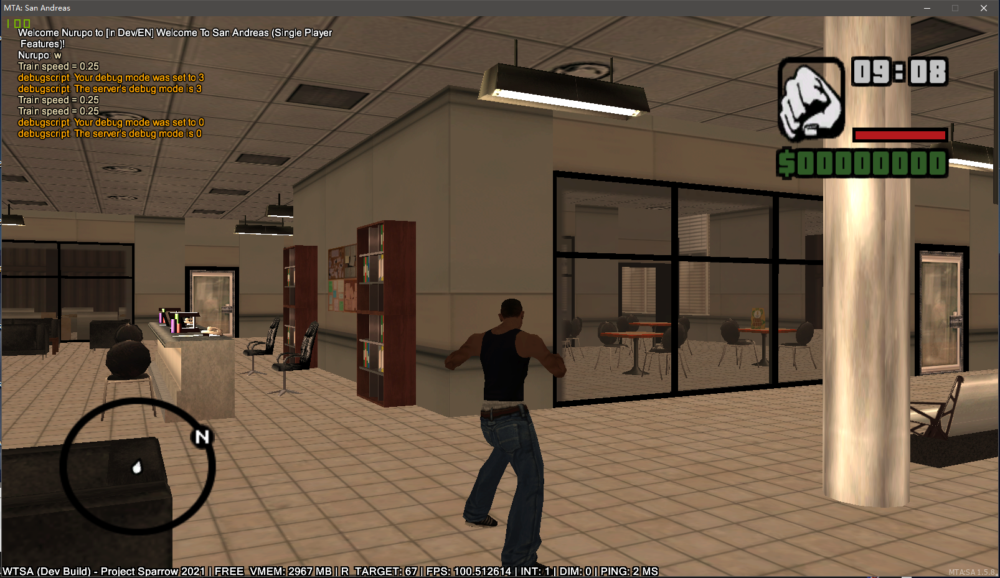
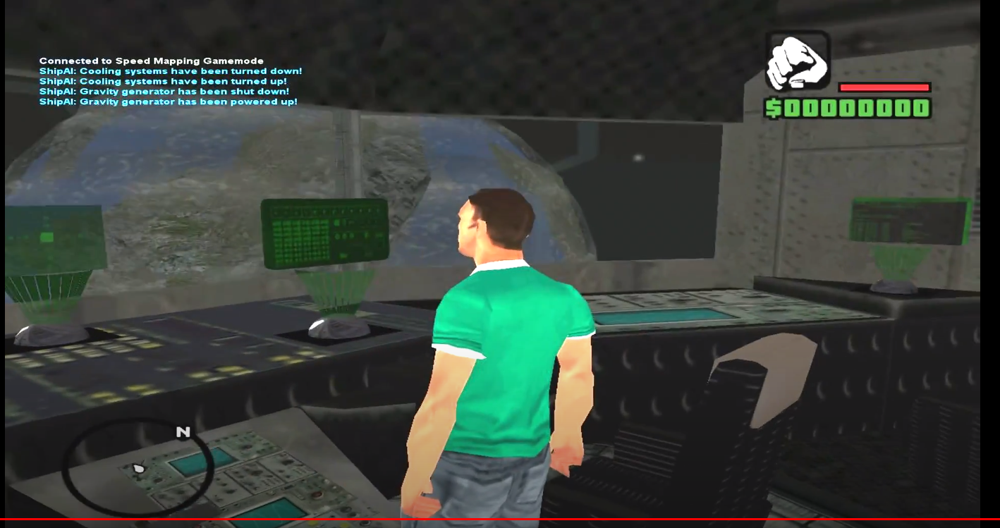
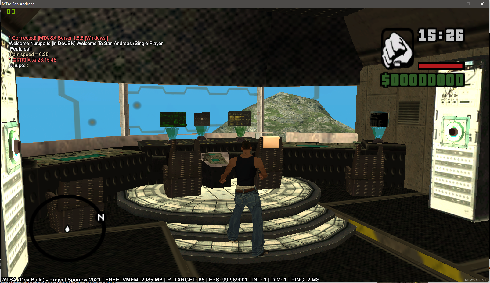

# SAMP MAP LOADER
Add support to load your favorite SA-MP maps into the MTA-SA!
## Screens 

Even works on this kinds of crazy map

## Resource Structure
* sampobj - provides the core functionality to load the samp.img, cols & texture materials.
* sampmap - SAMP Maploader, loads the map files either from specific format or SA-MP Texture-Studio file.
## Useage 
1. places the `sampobj` and `sampmap` into your mta-resrouces folder
2. in `sampmap` resources, find a file nammed `sampmap.lua` , it already contains a example map made by samp texture-studio (special thanks to author [Unu Alex](https://www.youtube.com/watch?v=Sb4cU0vY3T0) for the creation of this hard work.), you can add your own map under this file.
3. start the resources `sampobj` and `sampmap` & enjoy, you can check out `/testmap`  command to teleport you to the sample example samp map.
## Exports 
### sampobj
* `createSAMPObject(model_id,x,y,z,rx,ry,rz)` 
    * note the mode_id can be either sa stock object or an id from samp_model.
* `setObjectMaterial(object,mat_index,model_id,lib_name,txd_name,color)`

## Issues & todos in future
* Currently the material color is somehow bugged, especially the one contains the alpha materials.
* Drawdistance issue, due to the engine limitation the max distances viewdistance of a normal object is 300 unit, if your map contains the wide areas of custom samp objects, the far distances objects might not visible.
* High Memory Useage, due to the MTA current don't have the support of server-side defined object ids, therefore inorder to keep the original samp model id works i did a big mapping array to keep the mta-allocated ids & orignal samp ids in relation. however the down-side is the high RAM use, it might needs to takes some further optimzation in the furtue.